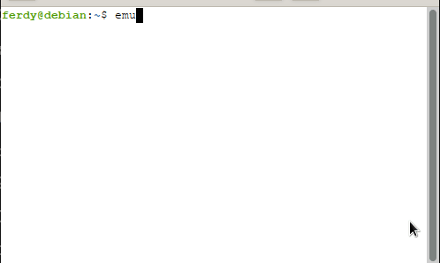
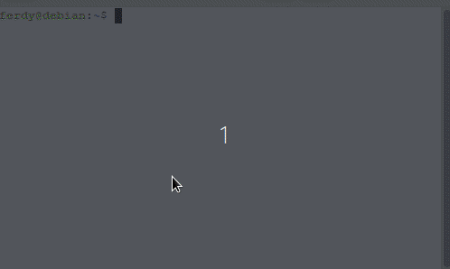
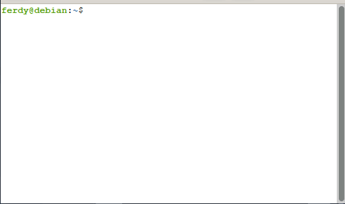
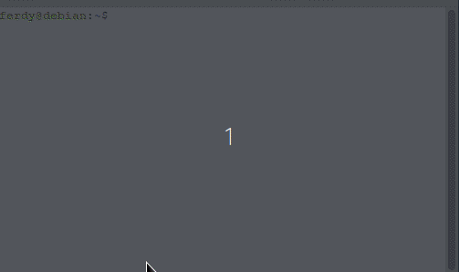

# 🛠 Android Emulator CLI Tool  


A powerful **terminal-based Android Emulator Manager** for Linux developers.  
Manage AVDs like a pro — launch, clone, reset, and delete — all without Android Studio.

👉 **[Skip to Demo Gallery ➡️](#-demo-gallery)**

---

## 🚀 Features

| Feature | Description |
|---------|-------------|
| ▶️ **Launch Emulator** | Silent launch & return to terminal |
| 🧬 **Clone Emulator** | Create named emulator copies & auto-launch |
| 🗑 **Delete Clones** | Safely remove clones (auto-kills if running) |
| 🧼 **Clear & Reboot** | Factory reset & auto-boot fresh Android |
| 🖥 **AMD/Linux Support** | Vulkan/Qt fixes for Debian & Ubuntu |
| ⚠️ **Running Check** | Prevents duplicate emulator launches |

---

## 🛡 System Requirements

| Requirement | Details |
|-------------|---------|
| OS | Linux (Debian/Ubuntu/Arch tested) |
| Android SDK | Emulator already installed (`emulator` in PATH) |
| Git & gh | For GitHub integration (optional) |
| CPU | Virtualization (KVM/QEMU) enabled |

---

## 📦 Installation

```bash
# Clone or create folder
mkdir android-emulator-cli-tool
cd android-emulator-cli-tool

# Create and paste script
nano run_emulator.sh

# Make script executable
chmod +x run_emulator.sh
```

#### 🔁 (Optional) Create Global Command (`emu`)
```bash
echo 'alias emu="~/android-emulator-cli-tool/run_emulator.sh"' >> ~/.bashrc
source ~/.bashrc
```

---

## 📋 Usage

```bash
emu
```

| Option | Action |
|--------|--------|
| 1️⃣ Launch Emulator | Opens AVD silently |
| 2️⃣ Clone Emulator | Name → auto-launch |
| 3️⃣ Delete Clones | Removes only custom AVDs |
| 4️⃣ Clear & Reboot | Factory reset + fresh boot |
| 5️⃣ Exit | Quit tool |

---

## 🎬 Demo Gallery

| Launch | Clone | Clear & Reboot | Delete |
|--------|--------|----------------|--------|
|  |  |  |  |

> Place your GIF files in the `examples/` folder.  
> Supports PNG, GIF, WebP.

---

## 🔮 Future Enhancements

- [ ] ADB Integration (install APK on boot)
- [ ] Logcat Viewer (debug console)
- [ ] Batch Emulator Testing
- [ ] Emulator Profiles / Presets

---

## 🤝 Support & Feedback

Found a bug or want a feature?

- 💬 Open an **Issue** on GitHub  
- 🔧 Submit a **Pull Request**  

Your contribution helps improve this tool!

---

## 🪪 License

This project is licensed under the **MIT License**.

---

## 👨‍💻 Created by Ferdy

Simplifying Android development — one terminal at a time.
